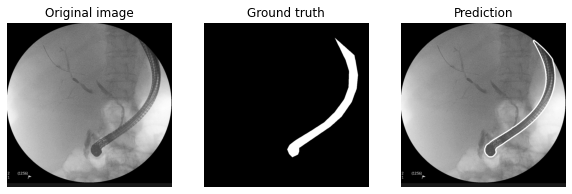
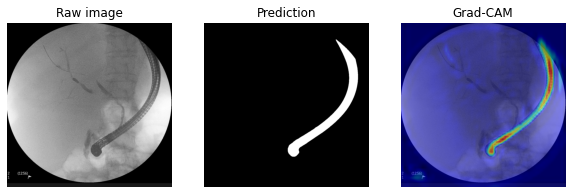
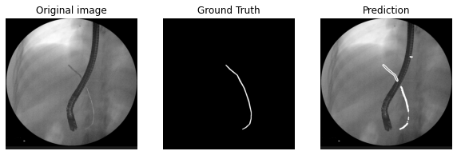

# mie_results

<h1>Instruments Segmentation in X-ray Fluoroscopic Images for Endoscopic Retrograde Cholangio Pancreatography</h1>

Garance MARTIN, Saad El-MADAFRI, Aymeric BECQ, Jérôme SZEWCZYK, Isabelle BLOCH

<h2>Qualitative results</h2>

<h3>Figure 1 : Example of endoscope segmentation</h3>

    

<h3>Figure 2 : Grad CAM algorithm applied to endoscope prediction</h3>

    

<h3>Figure 3 : Example of guidewire segmentation</h3>

    
